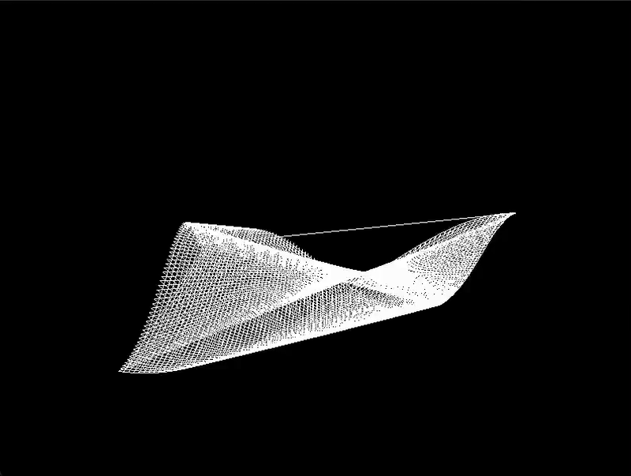

# Sideharso WGPU



A real-time 3D waveform visualization built with Rust and WGPU. This project renders an interactive wireframe grid that animates with wave-like patterns, creating a dynamic visual effect.

I used this project to refresh my knowledge of WGPU and Rust.

## Controls

- `W/S` - Move camera forward/backward
- `A/D` - Rotate camera left/right
- `Q/E` - Move camera up/down
- `ESC` - Exit application

## Prerequisites

- Rust (latest stable version)
- A GPU that supports Vulkan, Metal, DX12, or WebGL2

## Building and Running

1. Clone the repository:

```bash
bash
git clone https://github.com/thevilledev/sideharso-wgpu.git
cd sideharso-wgpu
```

3. Run the project:

```bash
cargo run
```

## Technical details

- **WGPU**: Modern, cross-platform graphics API abstraction
- **Winit**: Window creation and event handling
- **CGMath**: Mathematics for 3D graphics
- **Vertex Shader**: Implements wave animation using multiple sine waves
- **Fragment Shader**: Handles depth-based fade effects

## Implementation Notes

- The grid is rendered using line strips for cool looking wireframe visualization
- Wave animation is created by combining multiple sine waves with different frequencies
- Camera movement uses a simple first-person control scheme
- Depth buffer is used for proper 3D rendering and occlusion

## License

MIT